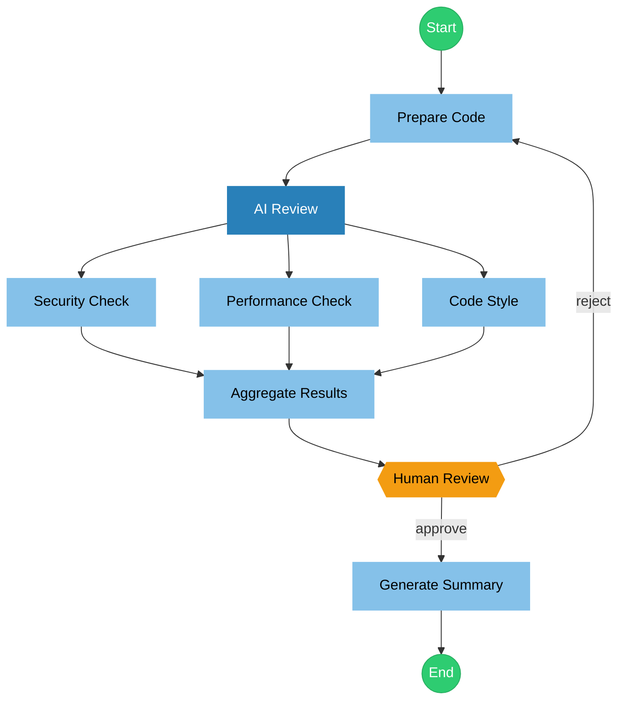

# Flowchestra

A Markdown-based multi-agent orchestration framework using Mermaid flowcharts.

## Overview

Flowchestra allows you to define complex multi-agent workflows in a single Markdown file, combining:

- **YAML frontmatter** for metadata and configuration
- **Mermaid flowchart** for visual workflow definition
- **Markdown sections** for agent prompts and node configuration

## Features

- **Visual Workflow Design** - Use Mermaid flowcharts to define agent interactions
- **Parallel Execution** - Run multiple agents concurrently
- **Conditional Branching** - Route based on agent outputs
- **Human-in-the-Loop** - Include manual approval nodes
- **Subgraphs** - Organize complex workflows into logical groups
- **State Management** - Share data between nodes via global state

## Comparison: Flowchestra vs LangGraph vs oh-my-opencode

Flowchestra focuses on a **Markdown-native workflow spec** that is visual, readable, and versionable. Compared to other approaches, it optimizes for clarity and portability of orchestration logic.

| Dimension | Flowchestra | LangGraph | oh-my-opencode |
|---|---|---|---|
| **Core focus** | Markdown-native workflow spec | Low-level graph orchestration framework | Batteries-included agent harness |
| **Definition format** | **Mermaid + Markdown** in a single file | Code-first graph APIs | CLI + plugin/tooling suite |
| **Readability & review** | **High** (docs are the workflow) | Medium (logic in code) | Medium (config + tooling) |
| **Onboarding cost** | **Low** (write Markdown + Mermaid) | Medium–High (graph/state APIs) | Medium (install + tool stack) |
| **Structure & reuse** | **High** (single-file spec, modular nodes) | High (graph composition) | Medium (preset agents & tools) |
| **Best fit** | Human-readable, sharable workflows | Long-running/stateful systems | Turnkey coding agent setups |

**Summary:**
- **LangGraph** is ideal when you need low-level control over stateful, long-running agents.
- **oh-my-opencode** shines as a full-stack, preconfigured agent environment.
- **Flowchestra** is the best choice when you want orchestration to be **visual, auditable, and easy to share** as a single Markdown artifact.

## Node Types

| Type | Mermaid Shape | Description |
|------|---------------|-------------|
| Agent | `[name]` Rectangle | AI agent node |
| Human | `{{name}}` Hexagon | Manual approval/input node |

### Agent Mode Colors

Agent nodes are color-coded by mode:

| Mode | Color | Description |
|------|-------|-------------|
| `all` | Dark Blue `#1a5276` | Full permission mode |
| `primary` | Medium Blue `#2980b9` | Primary orchestrating agent |
| `subagent` | Light Blue `#85c1e9` | Sub-agent (default) |

## Quick Example

## Workflow Structures

| Structure | Pattern | Behavior |
|-----------|---------|----------|
| **Sequential** | `A --> B --> C` | Execute in order |
| **Parallel** | `A --> B`, `A --> C` | Run B and C concurrently |
| **Merge** | `B --> D`, `C --> D` | Wait for all upstream nodes |
| **Conditional** | `A --\|yes\| B`, `A --\|no\| C` | Branch based on output |
| **Loop** | `B --> A` (back edge) | Retry/iterate |
| **Subgraph** | `subgraph name[...]` | Group related nodes |

## Implementations

- **OpenCode**: [`packages/opencode-flowchestra`](packages/opencode-flowchestra) implements the framework as a primary agent inside OpenCode.
- **Other agents**: future implementations may target different coding agents (e.g. Claude Code).

## Documentation

- [Flowchestra Specification](docs/FLOWCHESTRA_SPEC.md) - Complete specification
- [Flowchestra Example](docs/FLOWCHESTRA_EXAMPLE.md) - Code review workflow example

## License

MIT
