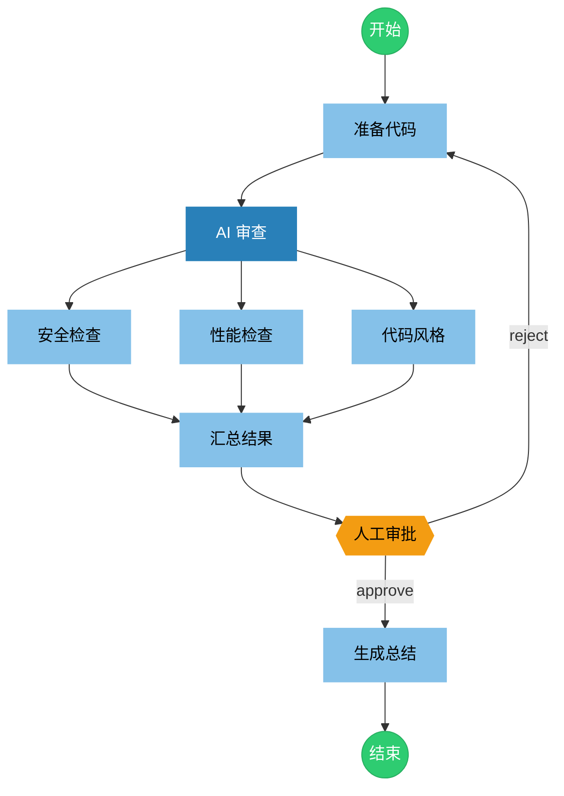

# Agents Orchestrator

A Markdown-based multi-agent orchestration framework using Mermaid flowcharts.

## Overview

Agents Orchestrator allows you to define complex multi-agent workflows in a single Markdown file, combining:

- **YAML frontmatter** for metadata and configuration
- **Mermaid flowchart** for visual workflow definition
- **Markdown sections** for agent prompts and node configuration

## Features

- **Visual Workflow Design** - Use Mermaid flowcharts to define agent interactions
- **Parallel Execution** - Run multiple agents concurrently
- **Conditional Branching** - Route based on agent outputs
- **Human-in-the-Loop** - Include manual approval nodes
- **Subgraphs** - Organize complex workflows into logical groups
- **State Management** - Share data between nodes via global state

## Node Types

| Type | Mermaid Shape | Description |
|------|---------------|-------------|
| Agent | `[name]` Rectangle | AI agent node |
| Human | `{{name}}` Hexagon | Manual approval/input node |

### Agent Mode Colors

Agent nodes are color-coded by mode:

| Mode | Color | Description |
|------|-------|-------------|
| `all` | Dark Blue `#1a5276` | Full permission mode |
| `primary` | Medium Blue `#2980b9` | Primary orchestrating agent |
| `subagent` | Light Blue `#85c1e9` | Sub-agent (default) |

## Quick Example

## Workflow Structures

| Structure | Pattern | Behavior |
|-----------|---------|----------|
| **Sequential** | `A --> B --> C` | Execute in order |
| **Parallel** | `A --> B`, `A --> C` | Run B and C concurrently |
| **Merge** | `B --> D`, `C --> D` | Wait for all upstream nodes |
| **Conditional** | `A --\|yes\| B`, `A --\|no\| C` | Branch based on output |
| **Loop** | `B --> A` (back edge) | Retry/iterate |
| **Subgraph** | `subgraph name[...]` | Group related nodes |

## Documentation

- [Workflow Specification](docs/WORKFLOW_SPEC.md) - Complete specification
- [Workflow Example](docs/WORKFLOW_EXAMPLE.md) - Code review workflow example

## License

MIT