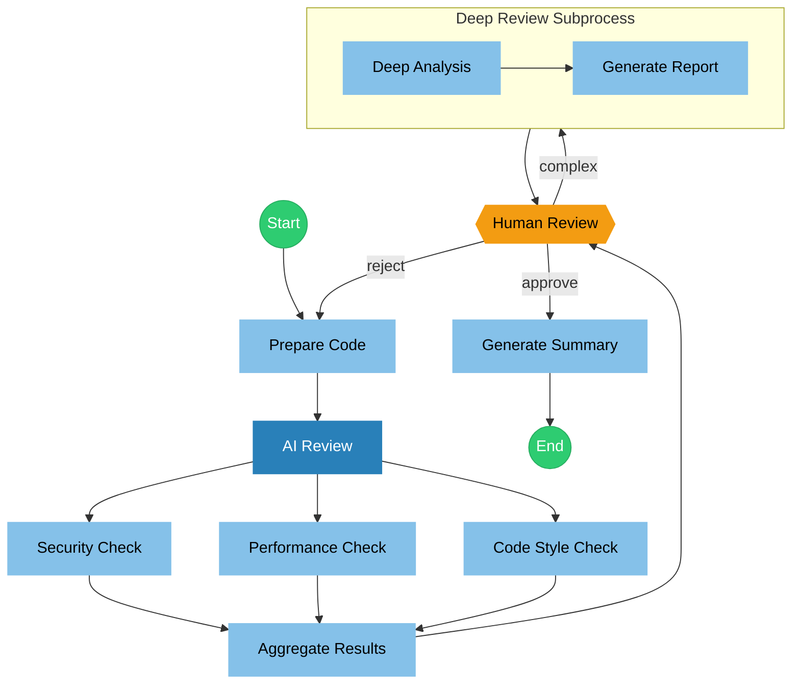

# Code Review Workflow

Automated code review workflow with the following features:

- **Parallel Checks**: Run security, performance, and code style checks concurrently
- **AI Review**: Aggregate results and make an initial decision
- **Conditional Branching**: Route based on review outcomes
- **Retry Loop**: Support re-analysis
- **Human Approval**: Require human decision for complex cases
- **Subprocess**: Deep review as a separate subprocess

## Flow

## Nodes

### prepare

---
description: "Prepare and read code for analysis"
mode: subagent
model: anthropic/claude-sonnet-4-20250514
temperature: 0.1

tools:
  read: true
  glob: true
  grep: true

input:
  userInput: "{{state.input}}"

output:
  key: "code_content"

config:
  timeout: 30000
---

You are a code preparation assistant. Based on user input, read and prepare the code content for analysis.

**User Input:**
{{state.input}}

Please read relevant code files and structure the content for subsequent analysis.

### ai_review

---
description: "AI review, dispatch parallel checks"
mode: primary
model: anthropic/claude-sonnet-4-20250514
temperature: 0.1
maxSteps: 10

tools:
  read: true
  glob: true
  grep: true
  write: false
  edit: false
  bash: false

permission:
  edit: deny
  bash: deny

input:
  userInput: "{{state.input}}"

output:
  key: "code_content"

config:
  timeout: 30000
---

You are a code preparation assistant. Based on user input, read and prepare the code content for analysis.

**User Input:**
{{state.input}}

Please read relevant code files and structure the content for subsequent analysis.

### security

---
description: "Security vulnerability check"
mode: subagent
model: anthropic/claude-sonnet-4-20250514
temperature: 0.1

tools:
  read: true
  grep: true

input:
  code: "{{state.code_content}}"

output:
  key: "security_result"
---

You are a security review expert. Check the following code for security vulnerabilities:

**Code Content:**
{{state.code_content}}

Focus on:
- SQL injection vulnerabilities
- XSS (Cross-Site Scripting)
- CSRF (Cross-Site Request Forgery)
- Sensitive data exposure
- Insecure dependencies
- Missing authorization checks

Please output a structured security report.

### performance

---
description: "Performance issue check"
mode: subagent
model: anthropic/claude-sonnet-4-20250514
temperature: 0.1

tools:
  read: true

input:
  code: "{{state.code_content}}"

output:
  key: "performance_result"
---

You are a performance optimization expert. Check the following code for performance issues:

**Code Content:**
{{state.code_content}}

Focus on:
- N+1 query issues
- Memory leak risks
- Unnecessary repeated calculations
- Missing caching optimizations
- Blocking operations
- Large data handling

Please output a structured performance report.

### code_style

---
description: "Code style check"
mode: subagent
model: anthropic/claude-sonnet-4-20250514
temperature: 0.1
hidden: true

tools:
  read: true

input:
  code: "{{state.code_content}}"

output:
  key: "style_result"
---

You are a code quality expert. Check the following code for style and quality issues:

**Code Content:**
{{state.code_content}}

Focus on:
- Naming conventions
- Code structure
- Comment completeness
- Function complexity
- Code duplication
- Error handling

Please output a structured code quality report.

### aggregate

---
description: "Aggregate all check results"
mode: subagent
model: anthropic/claude-sonnet-4-20250514
temperature: 0.2

input:
  security: "{{state.security_result}}"
  performance: "{{state.performance_result}}"
  code_style: "{{state.style_result}}"

output:
  key: "aggregated_result"
---

You are a code review aggregator. Please summarize the following check results:

**Security Results:**
{{state.security_result}}

**Performance Results:**
{{state.performance_result}}

**Code Style Results:**
{{state.style_result}}

Please synthesize and output:
1. Severity assessment
2. Key findings list
3. Prioritized improvement recommendations

### ai_review

---
description: "AI reviewer, make an initial decision"
mode: subagent
model: anthropic/claude-sonnet-4-20250514
temperature: 0.1

input:
  aggregated: "{{state.aggregated_result}}"

output:
  key: "review_decision"
---

You are a senior code reviewer. Based on the aggregated results, make a review decision.

**Aggregated Results:**
{{state.aggregated_result}}

Decide based on the following criteria:

- `approved`: Code quality is good and can pass
- `rejected`: Serious issues found; re-analysis required (triggers re-checks)
- `needs_human`: Complex issues require human judgment
- `complex`: Deep review required (enters deep review subprocess)

**Important: Return only one of the four labels above, and nothing else.**

### human_review

---
description: "Human approval node, make the final decision"
timeout: 86400000
onTimeout: "summarize"

options:
  - label: "Approve"
    value: "approve"
    description: "Code review passed, ready to merge"
  - label: "Reject"
    value: "reject"
    description: "Issues found, needs re-review"
  - label: "Deep Review"
    value: "complex"
    description: "Deep review required"

allowCustomInput: true

output:
  key: "human_decision"
---

## Human Approval Required

### Aggregated Results

{{state.aggregated_result}}

### AI Review Decision

{{state.review_decision}}

### Deep Review Report (if any)

{{state.deep_report}}

---

Please choose your decision or provide custom feedback.

### deep_analyze

---
description: "Deep code analysis"
mode: subagent
model: anthropic/claude-sonnet-4-20250514
temperature: 0.2
maxSteps: 20

tools:
  read: true
  grep: true
  glob: true

permission:
  webfetch: allow

input:
  code: "{{state.code_content}}"
  aggregated: "{{state.aggregated_result}}"

output:
  key: "deep_analysis"

config:
  timeout: 120000
  retry:
    maxAttempts: 2
---

You are a senior software architect. Perform a deep analysis of the code:

**Code Content:**
{{state.code_content}}

**Initial Findings:**
{{state.aggregated_result}}

Provide a deep analysis including:
1. Architecture assessment
2. Maintainability analysis
3. Scalability assessment
4. Test coverage recommendations
5. Refactoring recommendations

### deep_report

---
description: "Generate deep review report"
mode: subagent
model: anthropic/claude-sonnet-4-20250514
temperature: 0.3

input:
  analysis: "{{state.deep_analysis}}"

output:
  key: "deep_report"
---

You are a technical documentation expert. Based on the deep analysis, generate a detailed review report:

**Deep Analysis Results:**
{{state.deep_analysis}}

Produce a structured deep review report including:
1. Executive summary
2. Detailed findings
3. Risk assessment
4. Improvement roadmap
5. Priority recommendations

### summarize

---
description: "Workflow complete, generate final summary"
mode: subagent
model: anthropic/claude-sonnet-4-20250514

input:
  decision: "{{state.review_decision}}"
  humanDecision: "{{state.human_decision}}"
  aggregated: "{{state.aggregated_result}}"

output:
  key: "final_result"
---

The code review workflow is complete. Please generate the final summary:

**Review Decision:** {{state.review_decision}}
**Human Decision:** {{state.human_decision}}
**Aggregated Results:** {{state.aggregated_result}}

Please output a concise final review conclusion.
