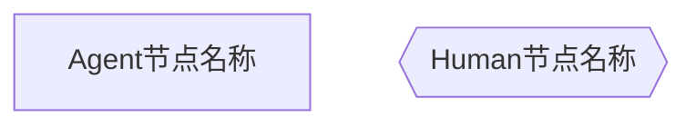
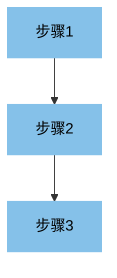
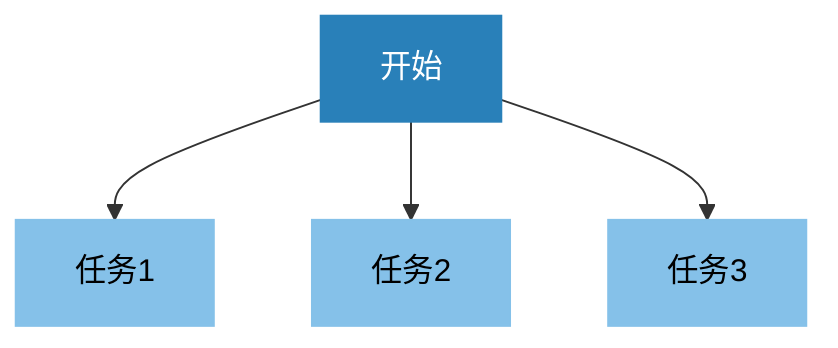
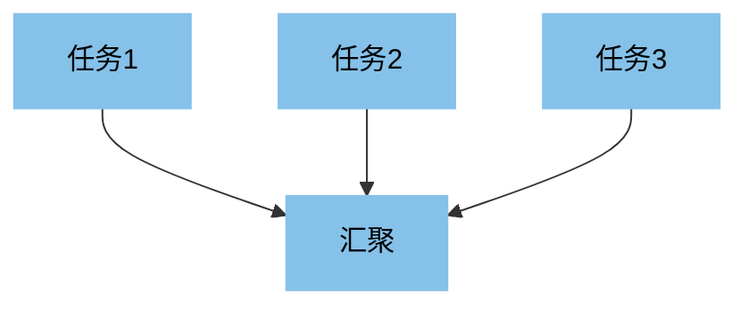
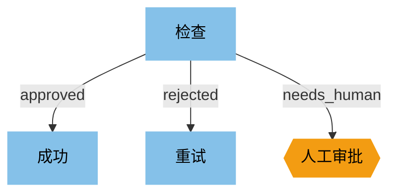
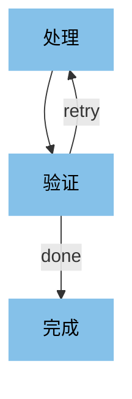
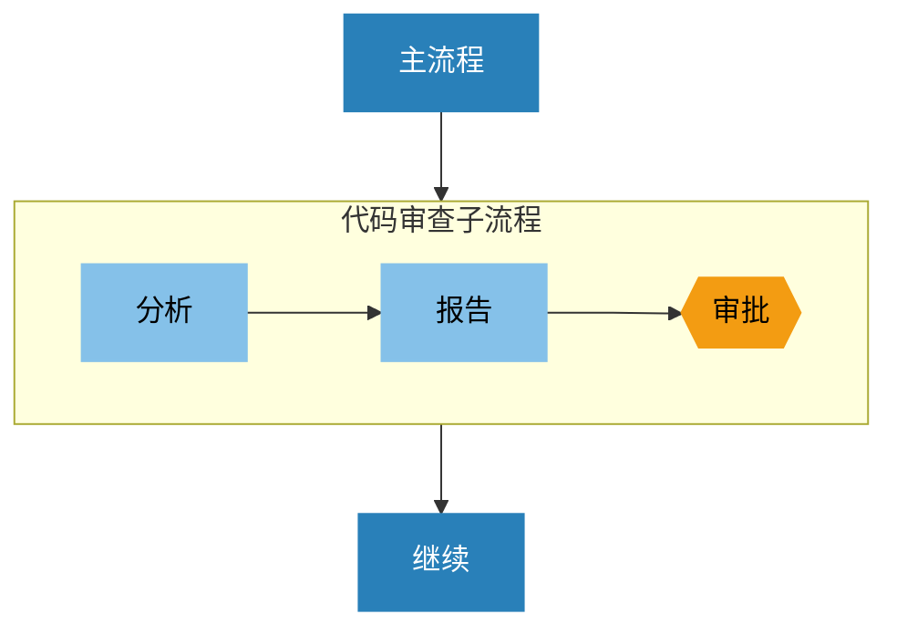

# Agents Orchestrator Workflow 规范

版本: 1.0

## 概述

本规范定义了一种基于 Markdown 的工作流编排格式，用于编排 OpenCode Agents。

### 设计理念

1. **单个 `.md` 文件** 定义完整工作流
2. **YAML frontmatter** 定义元数据和全局配置
3. **Mermaid flowchart** 定义流程图（利用 Mermaid 原生结构）
4. **Markdown 标题结构** 定义每个节点的详细配置
5. **与 OpenCode Agent 格式兼容** - 节点配置复用 OpenCode 的 agent 配置语法

### 节点类型

仅支持两种节点类型，通过 Mermaid 形状区分：

| 类型 | Mermaid 形状 | 说明 |
|------|--------------|------|
| Agent | `[name]` 矩形 | OpenCode Agent 节点 |
| Human | `{{name}}` 六边形 | 人工审批/输入节点 |

#### Agent 模式颜色

通过颜色深浅区分 Agent 模式：

| 模式 | 颜色 | 说明 |
|------|------|------|
| `all` | 深蓝 `#1a5276` | 完整权限模式 |
| `primary` | 中蓝 `#2980b9` | 主要 Agent |
| `subagent` | 浅蓝 `#85c1e9` | 子 Agent（默认） |

---

## 文件结构

```
---
# YAML Frontmatter: 工作流元数据
id: workflow-id
name: Workflow Name
version: "1.0"
...
---

# Workflow Name

描述...

## Flow

` ` `mermaid
flowchart TD
    start[开始] --> process[处理]
    process --> review{{审批}}
    
    classDef all fill:#1a5276,stroke:#1a5276,color:#fff
    classDef primary fill:#2980b9,stroke:#2980b9,color:#fff
    classDef subagent fill:#85c1e9,stroke:#85c1e9,color:#000
    classDef human fill:#f39c12,stroke:#f39c12,color:#000
    
    class start,process subagent
    class review human
` ` `

## Nodes

### start
---
model: anthropic/claude-sonnet-4-20250514
tools:
  read: true
---

Agent 的 prompt 内容...

### review
---
timeout: 86400000
options:
  - approve
  - reject
---

人工审批的提示内容...
```

---

## YAML Frontmatter

工作流元数据定义：

```yaml
---
# 必填字段
id: "workflow-id"                    # 工作流唯一标识
name: "Workflow Name"                # 显示名称

# 可选字段
version: "1.0"                       # 版本号
description: "描述信息"               # 工作流描述
entrypoint: "start"                  # 入口节点 (默认为流程图第一个节点)

# 全局状态定义
state:
  input: ""                          # 初始状态值
  result: null

# 全局配置
config:
  timeout: 300000                    # 工作流超时 (ms)
  maxIterations: 50                  # 最大循环次数 (防止无限循环)

# 全局重试策略
retry:
  maxAttempts: 3                     # 最大重试次数
  backoff: exponential               # 退避策略: fixed | linear | exponential
  initialDelay: 1000                 # 初始延迟 (ms)

# 全局错误处理
onError: "error_handler"             # 错误时跳转到指定节点
---
```

---

## Mermaid 流程图语法

### 基本结构

使用 Mermaid `flowchart TD`（从上到下）定义工作流：



### 节点命名规则

- 标识符: 小写字母、数字、下划线
- 通过形状区分类型: `[name]` Agent, `{{name}}` Human
- 通过颜色区分 Agent 模式


### 结构支持

Mermaid 原生支持以下结构，编排器根据图结构自动识别：

#### 串行执行

普通箭头连接表示顺序执行：



#### 并行执行

同一节点发出多条边表示并行执行：



#### 并行汇聚

多条边指向同一节点表示等待所有上游完成：



#### 条件分支

使用带标签的边表示条件分支：



Agent 节点需要在输出中返回对应的标签字符串，编排器根据输出匹配边标签决定下一步。

#### 循环

边指向拓扑序较早的节点表示循环：



#### 子流程

使用 `subgraph` 定义子流程：



---

## 节点定义

每个节点使用三级标题 `### 标识符` 定义，后跟 YAML 配置块和 Markdown 内容。节点类型通过 Mermaid 形状区分。

### Agent 节点

```markdown
### node_id

---
# Agent 配置 (与 OpenCode agent 格式一致)
description: "节点描述"
mode: subagent                       # Agent 模式: primary | subagent
model: anthropic/claude-sonnet-4-20250514
temperature: 0.1
maxSteps: 10
disable: false                       # 是否禁用此节点
hidden: false                        # 是否从自动完成菜单隐藏

# 外部 prompt 文件引用 (可选，替代下方的 Markdown 内容)
# prompt: "{file:./prompts/analyzer.md}"

# 工具权限
tools:
  read: true
  grep: true
  glob: true
  write: false
  edit: false
  bash: false

# 权限配置
permission:
  edit: deny
  bash: deny
  webfetch: allow
  # bash 命令级权限
  # bash:
  #   "*": ask
  #   "git status": allow
  # task 权限 (控制可调用的 subagent)
  # task:
  #   "*": allow
  #   "some-agent": deny

# 输入映射 (从全局状态获取)
input:
  code: "{{state.input}}"
  context: "{{state.context}}"

# 输出配置
output:
  key: "result_key"                  # 输出写入 state 的 key

# 节点级配置 (覆盖全局配置)
config:
  timeout: 60000
  retry:
    maxAttempts: 2
---

Agent 的 system prompt 内容...

支持使用模板变量：{{state.input}}
```

#### Agent 配置字段说明

| 字段 | 类型 | 必填 | 说明 |
|------|------|------|------|
| `description` | string | 是 | 节点描述，用于说明 Agent 的用途 |
| `mode` | string | 否 | Agent 模式: `primary` \| `subagent`，默认 `subagent` |
| `model` | string | 否 | 模型 ID，格式: `provider/model-id` |
| `temperature` | number | 否 | 温度参数 (0.0-1.0) |
| `maxSteps` | number | 否 | 最大执行步数，限制 Agent 迭代次数 |
| `disable` | boolean | 否 | 是否禁用此节点 |
| `hidden` | boolean | 否 | 是否从自动完成菜单隐藏 (仅 subagent) |
| `prompt` | string | 否 | 外部 prompt 文件引用，格式: `{file:./path.md}` |
| `tools` | object | 否 | 工具权限配置，支持通配符如 `mymcp_*: false` |
| `permission` | object | 否 | 权限配置: `allow` \| `ask` \| `deny` |
| `permission.edit` | string | 否 | 编辑权限 |
| `permission.bash` | string/object | 否 | Bash 权限，支持命令级配置 |
| `permission.webfetch` | string | 否 | Web 请求权限 |
| `permission.task` | object | 否 | Task 权限，控制可调用的 subagent |
| `input` | object | 否 | 输入映射，从全局状态获取数据 |
| `output.key` | string | 否 | 输出写入状态的 key |
| `config` | object | 否 | 节点级配置 (timeout, retry 等) |

### Human 节点

```markdown
### node_id

---
description: "人工审批节点"

# 超时配置
timeout: 86400000                    # 超时时间 (ms)，默认 24 小时
onTimeout: "timeout_handler"         # 超时后跳转节点

# 选项定义
options:
  - label: "Approve"                 # 显示文本
    value: "approve"                 # 返回值（用于边标签匹配）
    description: "批准通过"           # 选项描述
  - label: "Reject"
    value: "reject"
    description: "拒绝"

# 简写形式
# options:
#   - approve
#   - reject

# 允许自定义输入
allowCustomInput: true

# 输出配置
output:
  key: "human_decision"
---

显示给用户的提示内容...

支持 Markdown 格式和模板变量：

**当前状态:** {{state.result}}
```

#### Human 配置字段说明

| 字段 | 类型 | 必填 | 说明 |
|------|------|------|------|
| `description` | string | 否 | 节点描述 |
| `timeout` | number | 否 | 超时时间 (ms) |
| `onTimeout` | string | 否 | 超时跳转节点 |
| `options` | array | 是 | 选项列表 |
| `allowCustomInput` | boolean | 否 | 是否允许自定义输入 |
| `output.key` | string | 否 | 输出写入状态的 key |

---

## 模板变量语法

支持在 prompt 和配置中使用模板变量：

```
# 访问全局状态
{{state.variable}}
{{state.nested.field}}

# 访问上一个节点输出
{{output}}
{{output.field}}

# 访问特定节点输出
{{nodes.analyzer.output}}
{{nodes.analyzer.output.issues}}

# 条件表达式 (用于边标签匹配)
{{state.count}} > 3
{{state.status}} == 'approved'
```

---

## 编排器解析逻辑

编排器解析 Mermaid 流程图时，根据图结构确定执行逻辑：

| 结构 | 检测方式 | 执行逻辑 |
|------|----------|----------|
| **串行** | 节点只有一条出边 | 顺序执行 |
| **并行分支** | 节点有多条出边（无标签或标签相同） | 并发启动所有目标节点 |
| **条件分支** | 节点有多条出边（带不同标签） | 根据输出匹配标签 |
| **并行汇聚** | 节点有多条入边 | 等待所有上游节点完成 |
| **循环** | 边指向拓扑序较早的节点 | 允许重复执行 |
| **子流程** | `subgraph` 块 | 作为独立执行单元 |

### 边标签匹配规则

1. Agent 节点的 prompt 应要求返回特定标签字符串
2. 编排器获取 Agent 输出，与出边标签进行匹配
3. 匹配成功则执行对应目标节点
4. 无匹配时，如有 `default` 标签则执行该路径，否则报错

---

## 最佳实践

### 节点命名

- 使用有意义的标识符：`code_analyzer` 而非 `a1`
- 保持命名一致性

### Prompt 设计

- Agent 节点需要明确指示返回标签（用于条件分支）
- 使用模板变量传递上下文

### 错误处理

- 设置合理的超时时间
- 定义 `onError` 处理异常情况
- 使用 `maxIterations` 防止无限循环

### 状态管理

- 在 frontmatter 中定义初始状态结构
- 每个节点通过 `output.key` 写入状态
- 后续节点通过 `{{state.key}}` 读取
