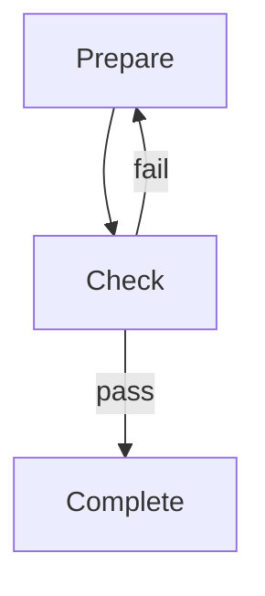

# OpenCode-Flowchestra

OpenCode-Flowchestra is an OpenCode primary agent that executes multi-agent workflows defined in Markdown files with Mermaid flowcharts.

## Key Features

- **AI-Native Understanding** - No Mermaid parser needed; AI reads and understands flowcharts
- **OpenCode Integration** - Native primary agent with full ecosystem access
- **Multi-Agent Orchestration** - Coordinates multiple subagents via Task tool
- **Control Flow Support** - Sequential, parallel, conditional, merge, and loop structures
- **Human-in-the-Loop** - Built-in support for human approval nodes
- **In-Memory State** - Simple state management during execution

## Installation

```bash
# Project-level (to .opencode/)
curl -fsSL https://raw.githubusercontent.com/Sheetaa/flowchestra/main/packages/opencode-flowchestra/install.sh | bash

# Or global (to ~/.config/opencode/)
curl -fsSL https://raw.githubusercontent.com/Sheetaa/flowchestra/main/packages/opencode-flowchestra/install.sh | bash -s -- --global

# Install from a specific branch
curl -fsSL https://raw.githubusercontent.com/Sheetaa/flowchestra/main/packages/opencode-flowchestra/install.sh | bash -s -- --branch develop
```


## Usage

### Switch to Flowchestra Agent

Press **Tab** to cycle through primary agents until you reach Flowchestra.

### Using @ Mention

```
@flowchestra Execute the code-review workflow
```

## Workflow File Format

Workflows are Markdown files with three sections:

### 1. YAML Frontmatter

```yaml
---
id: "my-workflow"
name: "My Workflow"
version: "0.1"

state:
  input: ""
  result: null

config:
  timeout: 300000
  maxIterations: 50
---
```

### 2. Mermaid Flowchart



### 3. Node Definitions

```markdown
### start

---
description: "Prepare the input"
mode: subagent
tools:
  read: true
output:
  key: "prepared_data"
---

Prepare the input data for processing.
Input: {{state.input}}
```

## Node Types

| Shape | Type | Description |
|-------|------|-------------|
| `[name]` | Agent | AI execution via subagent |
| `{{name}}` | Human | Requires user input |
| `((name))` | Marker | Start/End indicator |

## Control Flow

| Pattern | Meaning |
|---------|---------|
| `A --> B` | Sequential |
| `A --> B`, `A --> C` | Parallel |
| `B --> D`, `C --> D` | Merge (wait all) |
| `A --\|yes\| B` | Conditional |
| `B --> A` | Loop |

## Workflow Locations

OpenCode-Flowchestra searches for workflows in:

1. Exact path (if provided)
2. Current directory
3. `.opencode/workflows/`
4. `~/.config/opencode/workflows/`

## Example

See `examples/code-review.md` for a complete workflow example with:
- Parallel checks (security, performance, style)
- Human approval node
- Conditional branching
- Loop for retry

See `examples/ralph-wiggum.md` for a Ralph Wiggum loop workflow with:
- Stable prompt initialization
- Iterative task execution
- Completion promise detection

## Architecture

```
User Input
    |
    v
+-------------------+
| Flowchestra Agent |  (Primary Agent)
| - Reads workflow  |
| - Manages state   |
| - Decides flow    |
+-------------------+
    |
    | Task tool
    v
+-------------------+
| Subagents         |  (One per node)
| - security        |
| - performance     |
| - code_style      |
+-------------------+
```

## Documentation

- [Design Document](docs/opencode-flowchestra-design.v-0-1.md)
- [Flowchestra Specification](../docs/FLOWCHESTRA_SPEC.md)
- [Workflow Execution Skill](skills/flowchestra/SKILL.md)
- [Example Workflow](examples/code-review.md)

## License

MIT
