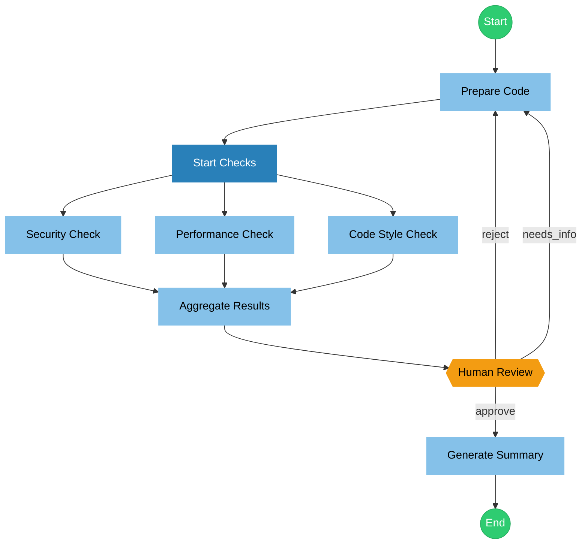

# Code Review Workflow

Automated code review workflow with the following features:

- **Parallel Checks**: Security, performance, and code style analysis run concurrently
- **Result Aggregation**: Combines all check results into a unified report
- **Human Approval**: Requires human decision for final verdict
- **Retry Loop**: Supports re-analysis if rejected
- **Error Handling**: Falls back to summarize on errors

## Flow

## Nodes

### prepare

---
description: "Read and prepare the code for analysis"
mode: subagent
model: anthropic/claude-sonnet-4-20250514
temperature: 0.1

tools:
  read: true
  glob: true
  grep: true

input:
  userInput: "{{state.input}}"

output:
  key: "code_content"

config:
  timeout: 30000
---

You are a code preparation assistant. Based on the user's input, read and prepare the code content for analysis.

**User Input:**
{{state.input}}

Please:
1. Identify the files to be reviewed
2. Read the relevant code files
3. Structure the content for subsequent analysis

Return the code content in a structured format.

### parallel_start

---
description: "Coordinator for parallel checks"
mode: primary
model: anthropic/claude-sonnet-4-20250514
temperature: 0.1

input:
  code: "{{state.code_content}}"

output:
  key: "parallel_started"
---

The code has been prepared. Now initiating parallel checks for:
- Security analysis
- Performance analysis  
- Code style analysis

All checks will run concurrently.

### security

---
description: "Security vulnerability analysis"
mode: subagent
model: anthropic/claude-sonnet-4-20250514
temperature: 0.1

tools:
  read: true
  grep: true

input:
  code: "{{state.code_content}}"

output:
  key: "security_result"

config:
  timeout: 60000
---

You are a security expert. Analyze the following code for security vulnerabilities:

**Code Content:**
{{state.code_content}}

Focus on:
- SQL injection vulnerabilities
- XSS (Cross-Site Scripting)
- CSRF (Cross-Site Request Forgery)
- Sensitive data exposure
- Insecure dependencies
- Missing authentication/authorization
- Input validation issues

Output a structured security report with:
1. Severity level (Critical/High/Medium/Low)
2. List of findings
3. Recommendations

### performance

---
description: "Performance issue analysis"
mode: subagent
model: anthropic/claude-sonnet-4-20250514
temperature: 0.1

tools:
  read: true

input:
  code: "{{state.code_content}}"

output:
  key: "performance_result"

config:
  timeout: 60000
---

You are a performance optimization expert. Analyze the following code for performance issues:

**Code Content:**
{{state.code_content}}

Focus on:
- N+1 query problems
- Memory leak risks
- Unnecessary repeated calculations
- Missing caching opportunities
- Blocking operations
- Large data handling issues
- Algorithm complexity

Output a structured performance report with:
1. Impact level (High/Medium/Low)
2. List of issues found
3. Optimization suggestions

### code_style

---
description: "Code style and quality analysis"
mode: subagent
model: anthropic/claude-sonnet-4-20250514
temperature: 0.1

tools:
  read: true

input:
  code: "{{state.code_content}}"

output:
  key: "style_result"

config:
  timeout: 60000
---

You are a code quality expert. Analyze the following code for style and quality issues:

**Code Content:**
{{state.code_content}}

Focus on:
- Naming conventions
- Code structure and organization
- Comment completeness
- Function complexity (cyclomatic complexity)
- Code duplication
- Error handling patterns
- Best practices adherence

Output a structured quality report with:
1. Quality score (1-10)
2. List of issues
3. Improvement suggestions

### aggregate

---
description: "Aggregate all check results"
mode: subagent
model: anthropic/claude-sonnet-4-20250514
temperature: 0.2

input:
  security: "{{state.security_result}}"
  performance: "{{state.performance_result}}"
  style: "{{state.style_result}}"

output:
  key: "aggregated_result"
---

You are a code review coordinator. Aggregate the following check results into a unified report:

**Security Check Results:**
{{state.security_result}}

**Performance Check Results:**
{{state.performance_result}}

**Code Style Check Results:**
{{state.style_result}}

Please synthesize and output:
1. Overall assessment summary
2. Critical issues requiring immediate attention
3. Prioritized list of all findings
4. Recommended actions
5. Overall recommendation (Approve / Reject / Needs Discussion)

### human_review

---
description: "Human approval node for final decision"
timeout: 86400000
onTimeout: "summarize"

options:
  - label: "Approve"
    value: "approve"
    description: "Code review passed, ready to merge"
  - label: "Reject"
    value: "reject"
    description: "Code has issues, needs rework and re-review"
  - label: "Need More Info"
    value: "needs_info"
    description: "Need additional analysis or clarification"

allowCustomInput: true

output:
  key: "human_decision"
---

## Code Review - Human Approval Required

### Aggregated Results

{{state.aggregated_result}}

---

Please review the above analysis and make your decision:

- **Approve**: The code passes review and can proceed
- **Reject**: The code needs changes and should be re-analyzed
- **Need More Info**: Additional analysis or clarification is needed

You may also provide custom feedback.

### summarize

---
description: "Generate final summary report"
mode: subagent
model: anthropic/claude-sonnet-4-20250514
temperature: 0.3

input:
  aggregated: "{{state.aggregated_result}}"
  decision: "{{state.human_decision}}"

output:
  key: "final_result"
---

Generate the final code review summary:

**Aggregated Analysis:**
{{state.aggregated_result}}

**Human Decision:**
{{state.human_decision}}

Please output a concise final report including:
1. Review outcome
2. Key findings summary
3. Required actions (if any)
4. Next steps
