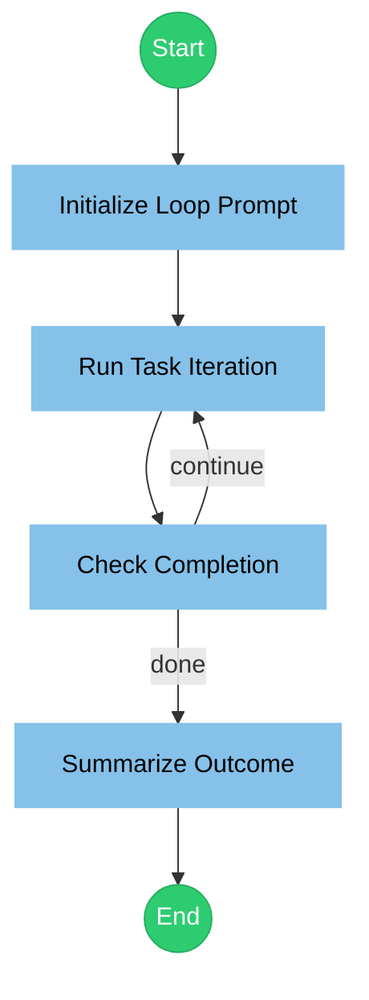

# Ralph Wiggum Loop Workflow

This workflow demonstrates the Ralph Wiggum technique: a stable prompt is repeated in a loop until a completion promise is detected.

## Flow

## Nodes

### initialize

---
description: "Construct a stable loop prompt"
mode: subagent
model: anthropic/claude-sonnet-4-20250514
temperature: 0.2

input:
  task: "{{state.task}}"
  completion_promise: "{{state.completion_promise}}"

output:
  key: "iteration_prompt"
---

You are a prompt preparation assistant. Build a stable loop prompt that will be reused on each iteration.

Requirements:
1. Include the task description exactly as provided.
2. State the completion promise string explicitly.
3. Require the completion promise to appear as the final line when the task is done.
4. If not done, instruct the agent to end with a brief status and next steps, without the promise.

Task:
{{state.task}}

Completion promise: "{{state.completion_promise}}"

Return only the final loop prompt.

### loop_task

---
description: "Execute one Ralph iteration"
mode: subagent
model: anthropic/claude-sonnet-4-20250514
temperature: 0.2

tools:
  read: true
  glob: true
  grep: true
  edit: true
  write: true
  bash: true

input:
  prompt: "{{state.iteration_prompt}}"

output:
  key: "iteration_result"

config:
  timeout: 300000
---

You are running a Ralph iteration. Follow the loop prompt below exactly, perform the task in the repository, and report progress.

Loop prompt:
{{state.iteration_prompt}}

### check_completion

---
description: "Detect completion promise"
mode: subagent
model: anthropic/claude-sonnet-4-20250514
temperature: 0

input:
  result: "{{state.iteration_result}}"
  completion_promise: "{{state.completion_promise}}"

output:
  key: "completion_status"
---

You are a strict verifier. Inspect the iteration result and decide whether the completion promise appears.

Rules:
- If the exact completion promise string appears anywhere in the result, output: done
- Otherwise, output: continue

Output only one word: done or continue.

### summarize

---
description: "Summarize the loop outcome"
mode: subagent
model: anthropic/claude-sonnet-4-20250514
temperature: 0.3

input:
  result: "{{state.iteration_result}}"
  status: "{{state.completion_status}}"

output:
  key: "final_summary"
---

Summarize the final loop outcome based on the latest iteration result and status.

Include:
1. Whether completion was detected
2. The most important changes or outputs
3. Any remaining issues or next steps
