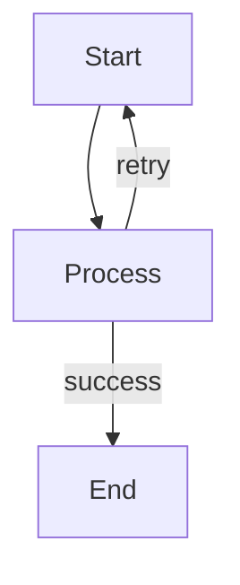

# Workflow Execution Skill

This skill provides detailed guidance for executing Mermaid-based multi-agent workflows.

## When to Use

Use this skill when you need to:
- Execute a workflow defined in a Markdown file
- Understand how to parse workflow structure
- Handle complex control flows (parallel, conditional, loops)
- Manage workflow state

## Workflow File Structure

A workflow file contains three sections:

### 1. YAML Frontmatter

```yaml
---
id: "workflow-id"
name: "Workflow Name"
entrypoint: "start_node"

state:
  input: ""
  result: null

config:
  timeout: 300000
  maxIterations: 50
---
```

### 2. Mermaid Flowchart



### 3. Node Definitions

```markdown
### node_id

---
description: "What this node does"
mode: subagent
model: anthropic/claude-sonnet-4-20250514
tools:
  read: true
input:
  data: "{{state.input}}"
output:
  key: "result_key"
---

Agent prompt content here...
Use {{state.variable}} for template variables.
```

## Execution Steps

### Step 1: Load and Parse

1. Read the workflow Markdown file
2. Extract YAML frontmatter
3. Identify the Mermaid flowchart section
4. Parse each `### node_id` section

### Step 2: Build Graph Understanding

From the Mermaid flowchart, understand:
- All node IDs and their shapes (Agent `[]` vs Human `{{}}`)
- Edge connections and their labels
- Parallel branches (multiple edges from one node)
- Merge points (multiple edges to one node)
- Loops (edges pointing backwards)

### Step 3: Initialize State

```javascript
state = {
  // Copy from frontmatter.state
  ...initialState,
  
  // Internal tracking
  _workflow_id: id,
  _current_node: entrypoint,
  _completed_nodes: [],
  _pending_parallel: [],
  _iteration_count: 0
}
```

### Step 4: Execute Nodes

For each node:

**Agent Node** (`[name]`):
1. Get node config and prompt
2. Replace template variables in prompt
3. Call Task tool with prepared prompt
4. Store output: `state[output.key] = result`
5. Add to `_completed_nodes`

**Human Node** (`{{name}}`):
1. Get node config and options
2. Replace template variables in display content
3. Call Question tool with options
4. Store choice: `state[output.key] = user_choice`
5. Add to `_completed_nodes`

### Step 5: Determine Next Node

| Scenario | Detection | Action |
|----------|-----------|--------|
| Sequential | One unlabeled outgoing edge | Execute target |
| Parallel | Multiple unlabeled outgoing edges | Execute ALL targets together |
| Conditional | Labeled outgoing edges | Match output to label |
| Merge | Multiple incoming edges | Wait for all upstream |
| Loop | Edge to earlier node | Check iteration count |
| End | No outgoing edges | Complete workflow |

### Step 6: Handle Parallel Execution

When parallel:
1. Launch all target nodes using multiple Task calls in one response
2. Track in `_pending_parallel`
3. As each completes, move to `_completed_nodes`
4. Proceed to merge only when all complete

### Step 7: Handle Conditionals

1. Get the output from previous node
2. Match against edge labels
3. If match found, follow that edge
4. If no match, use `default` label if exists
5. If no default, report error

### Step 8: Handle Loops

1. Detect loop by edge pointing to earlier node
2. Increment `_iteration_count`
3. Check against `maxIterations`
4. If exceeded, exit loop with warning

## Template Variables

| Syntax | Meaning |
|--------|---------|
| `{{state.key}}` | Value from state |
| `{{state.a.b}}` | Nested state value |
| `{{output}}` | Previous node output |
| `{{nodes.id.output}}` | Specific node output |

## Error Handling

1. **Node Failure**: Check for retry config, apply backoff
2. **Missing Node**: Report error, check for `onError` handler
3. **Infinite Loop**: Stop at `maxIterations`
4. **Timeout**: Respect workflow and node timeouts

## Best Practices

1. Use TodoWrite to track execution progress
2. Log which branch is taken at conditionals
3. Clearly report parallel execution status
4. Summarize results when workflow completes
5. Handle errors gracefully with clear messages
